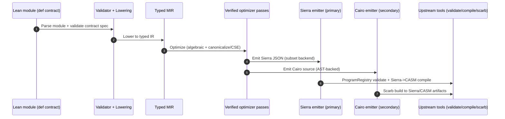

# LeanCairoMVP

Lean 4 compiler project with:

1. Primary lane: `Lean -> Typed MIR -> Sierra -> CASM`
2. Secondary lane: `Lean -> Typed MIR -> Cairo source`

The primary objective is function-level compilation and optimization, with strict fail-fast behavior outside the implemented subset.

## Current State

1. Lean -> Cairo generation is deterministic and end-to-end tested with Scarb build/ABI checks.
2. Direct Lean -> Sierra subset generation is implemented, validated with pinned upstream Sierra tooling, and compiled to CASM.
3. Typed optimizer pipeline includes algebraic fold + CSE/let-normalization with Lean soundness theorems.
4. Structured Cairo AST emission boundary is implemented for backend determinism and parity checks.
5. Example workspace is canonical under `examples/` with mirrored Lean/Sierra/Cairo outputs generated by CLI.

## Canonical Planning Docs

1. `roadmap/executable-issues/INDEX.md`
2. `roadmap/README.md`
3. `spec2.md`
4. `spec.md`

Roadmap executable issues are the active execution contract.

## Architecture



## What It Can Do Now

1. Compile typed Lean `ContractSpec` modules to Cairo source.
2. Build generated Cairo via Scarb and validate ABI surfaces.
3. Compile typed Lean IR directly to Sierra JSON in the implemented subset.
4. Validate direct Sierra output using pinned upstream Sierra crates.
5. Compile direct Sierra output to CASM.
6. Run backend parity checks (direct Sierra signatures vs Cairo ABI signatures) for covered corpora.
7. Run optimizer non-regression gates, including per-family threshold policy from `config/optimizer-family-thresholds.json`.
8. Generate mirrored examples from canonical Lean sources in `examples/Lean` to `examples/Sierra` and `examples/Cairo`.
9. Generate review-only Sierra->Cairo-like output with statement anchors (non-authoritative, isolated from compilation path).

## Current Constraints

1. Not a compiler from arbitrary Lean programs.
2. Not yet a full, formally verified Lean->Sierra/Cairo semantics-preserving compiler.
3. Direct Sierra backend remains a strict subset with explicit fail-fast bounds.
4. Direct Sierra subset currently enforces:
   1. view-only functions, no storage writes
   2. user signature types limited to `felt252`, `u128`, `bool`
   3. supported expression families centered on literals, vars/let, `felt252` arithmetic, top-level `eq`, and wrapping `u128 add/sub/mul` with explicit `RangeCheck` threading
5. Unsupported direct-Sierra forms fail fast with explicit error contracts.

## Quick Start

Prerequisites:

1. `elan` / `lake` (`~/.elan/bin` on `PATH`)
2. `scarb`
3. `rust`/`cargo`

Generate Cairo from Lean module:

```bash
export PATH="$HOME/.elan/bin:$PATH"
lake exe leancairo-gen \
  --module MyLeanContract \
  --out ./generated_contract \
  --emit-casm false \
  --optimize true
```

Generate direct Sierra (subset backend):

```bash
export PATH="$HOME/.elan/bin:$PATH"
lake exe leancairo-sierra-gen \
  --module MyLeanSierraScalar \
  --out ./generated_sierra \
  --optimize true
```

Run full lanes:

```bash
./scripts/workflow/run-sierra-checks.sh
./scripts/workflow/run-mvp-checks.sh
```

Generate mirrored examples:

```bash
./scripts/examples/generate_examples.sh
./scripts/test/examples_structure.sh
```

## CLI Reference

### Lean -> Cairo

```bash
lake exe leancairo-gen \
  --module <LeanModule> \
  --out <OutputDirectory> \
  [--emit-casm true|false] \
  [--optimize true|false] \
  [--inlining-strategy default|avoid|<n>]
```

### Lean -> Sierra (subset)

```bash
lake exe leancairo-sierra-gen \
  --module <LeanModule> \
  --out <OutputDirectory> \
  [--optimize true|false]
```

`<LeanModule>` requirement:

```lean
import LeanCairo.Core.Spec.ContractSpec

namespace Some.Module

def contract : LeanCairo.Core.Spec.ContractSpec := ...

end Some.Module
```

## Examples Workspace

Canonical example source is stored in `examples/Lean`.

Mirrored outputs:

1. `examples/Sierra/<example-id>/...`
2. `examples/Cairo/<example-id>/...`

Manifest:

1. `config/examples-manifest.json` defines `<example-id> -> module -> source paths`.
2. Sources must reside under `examples/Lean/<example-id>/`.

Details: `examples/README.md`

## Proof and Optimization Status

Key components:

1. Verified pass interface: `src/LeanCairo/Compiler/Optimize/Pass.lean`
2. Optimizer pipeline: `src/LeanCairo/Compiler/Optimize/Pipeline.lean`
3. Algebraic fold soundness: `src/LeanCairo/Compiler/Proof/OptimizeSound.lean`
4. CSE/let-normalization soundness: `src/LeanCairo/Compiler/Proof/CSELetNormSound.lean`
5. Contract-level optimizer soundness: `src/LeanCairo/Compiler/Proof/IRSpecSound.lean`

Current implemented optimizer lane is MIR-level; broader Sierra/CASM optimization roadmap remains in progress.

## Quality Gates

Core scripts:

1. `scripts/workflow/run-sierra-checks.sh`
2. `scripts/workflow/run-mvp-checks.sh`
3. `scripts/roadmap/list_quality_gates.sh --validate-workflows`

Selected focused gates:

1. `scripts/test/backend_parity.sh`
2. `scripts/test/cairo_ast_idempotence.sh`
3. `scripts/test/optimizer_pass_regression.sh`
4. `scripts/bench/check_optimizer_non_regression.sh`
5. `scripts/bench/check_optimizer_family_thresholds.sh`
6. `scripts/test/sierra_review_lift.sh`

## Repository Map

1. `src/LeanCairo/Core`: typed domain, syntax, specs, validation
2. `src/LeanCairo/Compiler`: IR, semantics, optimization, proofs
3. `src/LeanCairo/Backend/Cairo`: Cairo emission (`Ast`, expression/function/contract emit)
4. `src/LeanCairo/Backend/Sierra`: direct Sierra subset backend and pinned surface bindings
5. `src/LeanCairo/Pipeline/Generation`: Lean->Cairo generation pipeline
6. `src/LeanCairo/Pipeline/Sierra`: Lean->Sierra generation pipeline
7. `src/LeanCairo/CLI`: Cairo generator CLI
8. `src/LeanCairo/SierraCLI`: Sierra generator CLI
9. `scripts/workflow`: top-level quality lanes
10. `scripts/test`: deterministic regression/fail-fast/parity checks
11. `scripts/bench`: artifact + performance gates
12. `examples`: canonical examples workspace and mirrored outputs
13. `roadmap`: executable issues, inventories, reports, acceptance gates

## Notes

1. Roadmap tracks `05`, `06`, and `07` are active and not fully closed yet.
2. Issue statuses are enforced by executable checks; see `roadmap/executable-issues/*.issue.md`.
3. Review-lift output is for human audit only and is isolated from compilation semantics.
