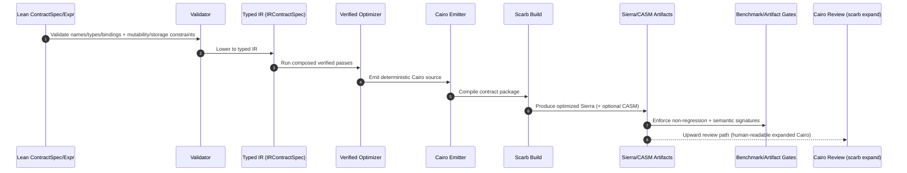

# LeanCairoMVP

Lean 4 EDSL -> Cairo Starknet contract generator (MVP), aligned to [`spec.md`](spec.md).

Status: Lean -> Cairo -> Scarb is wired and passing end-to-end in this repository.

## What This Is (and Is Not)

- This is a constrained Lean DSL -> Cairo compiler pipeline (not just a shell wrapper around templates).
- It compiles typed `ContractSpec`/`Expr` data from Lean into deterministic Cairo contract source and Scarb artifacts.
- It is **not** a compiler from arbitrary Lean programs to Cairo.
- It is **not yet** a full end-to-end formally verified semantics-preserving Lean->Cairo compiler.

Current proof scope:

- Typed IR optimizer soundness is proved in Lean ([`src/LeanCairo/Compiler/Proof/OptimizeSound.lean`](src/LeanCairo/Compiler/Proof/OptimizeSound.lean)).
- CSE + let-normalization soundness is proved in Lean ([`src/LeanCairo/Compiler/Proof/CSELetNormSound.lean`](src/LeanCairo/Compiler/Proof/CSELetNormSound.lean)).
- A typed verified pass interface with compositional soundness obligations is implemented in [`src/LeanCairo/Compiler/Optimize/Pass.lean`](src/LeanCairo/Compiler/Optimize/Pass.lean).
- Proof is over the IR evaluator semantics ([`src/LeanCairo/Compiler/Semantics/Eval.lean`](src/LeanCairo/Compiler/Semantics/Eval.lean)), not full Cairo VM semantics yet.
- Contract-level optimizer soundness is proved over function outcomes (return value + post-storage context) in [`src/LeanCairo/Compiler/Proof/IRSpecSound.lean`](src/LeanCairo/Compiler/Proof/IRSpecSound.lean).
- Generation now runs through an IR-native emission lane (`ContractSpec -> IRContractSpec -> IR optimize -> Cairo emit`).

## Pipeline Overview



1. Author a contract as typed Lean data (`ContractSpec` / `Expr`).
2. Validate names/types/bindings and mutability/storage constraints.
3. Lower to typed IR (`IRContractSpec`).
4. Run verified optimizer passes (`algebraic-fold |> cse-let-normalization`).
5. Emit Cairo from IR.
6. Compile with Scarb to Sierra (and optional CASM).
7. Gate performance/non-regression on produced artifacts.

## What You Can Do Now

1. Define contract behavior in Lean as `ContractSpec` data, including storage fields.
2. Generate Starknet Cairo contract source deterministically from that Lean spec.
3. Compile generated Cairo with Scarb to Sierra artifacts.
4. Optionally emit CASM by passing `--emit-casm true`.
5. Validate generated ABI surface automatically against expected signatures.
6. Run a full quality gate ([`./scripts/workflow/run-mvp-checks.sh`](scripts/workflow/run-mvp-checks.sh)) covering lint + snapshot + build + ABI checks.
7. Generate both `view` and `external` entrypoints from Lean mutability settings.
8. Generate storage reads/writes for mutable functions.
9. Run an optimizer non-regression benchmark gate (optimized score must be <= baseline score).
10. Run deterministic step-comparison benchmarks for arithmetic/control-flow kernels in [`packages/fixedpoint_bench`](packages/fixedpoint_bench).

## Current MVP Limits

- No events, no syscalls, no cross-contract calls.
- Expression language is intentionally small and pure (no loops, no recursion, no dynamic memory structures).
- Felt arithmetic is restricted to pass-through/equality semantics in this MVP.
- Optimization currently includes algebraic simplification plus a non-trivial CSE + let-normalization pass over typed IR.

## Mutable Execution Law

- For mutable functions, write-value expressions and return expression are evaluated once in pre-state, then writes are committed.
- Generated Cairo now stages these values in temporaries before `self.<field>.write(...)` statements to avoid accidental re-evaluation after mutation.
- Duplicate writes to the same storage field within one function are rejected by validation.

## Efficiency Expectations

- Current state: this does **not** yet reliably beat careful hand-written Cairo.
- Current guarantee: optimization is benchmark-gated for non-regression using CASM+Sierra artifact metrics ([`scripts/bench/check_optimizer_non_regression.sh`](scripts/bench/check_optimizer_non_regression.sh)).
- A dedicated CSE benchmark contract gate is run in the workflow (`MyLeanContractCSEBench` -> `CSEBenchContract`).
- Additional tuning path: compiler inlining strategy sweep ([`scripts/bench/tune_inlining_strategy.sh`](scripts/bench/tune_inlining_strategy.sh)) over real artifacts.
- To consistently outperform manual Cairo, next work is required:
  - richer typed IR passes (CSE, let normalization, storage-access optimization, specialization/inlining),
  - stronger cost model tied to Sierra/Cairo execution metrics,
  - benchmark suites representing realistic workloads.

Measured sample benchmark deltas (from [`packages/fixedpoint_bench`](packages/fixedpoint_bench)):

- `qmul`: `499 -> 255` steps (48.90% fewer, 1.96x faster)
- `qexp`: `1605 -> 384` steps (76.07% fewer, 4.18x faster)
- `qlog`: `973 -> 401` steps (58.79% fewer, 2.43x faster)
- `qnewton`: `1195 -> 512` steps (57.15% fewer, 2.33x faster)
- `fib`: `1226 -> 299` steps (75.61% fewer, 4.10x faster)

See [`docs/fixed-point/benchmark-results.md`](docs/fixed-point/benchmark-results.md) for measurement method and reproducible commands.

## Quick Start Guides

Prerequisites:

- Lean/Lake installed (typically via `elan`)
- Scarb installed

Guide 1: Generate + build the canonical contract:

```bash
export PATH="$HOME/.elan/bin:$PATH"
lake exe leancairo-gen --module MyLeanContract --out ./generated_contract --emit-casm false
cd generated_contract
scarb build
```

Expected outputs:

- `target/dev/<target>_<contract>.contract_class.json`
- `target/dev/<target>.starknet_artifacts.json`

Guide 2: Run the full quality gate (lint + build + snapshot + e2e + optimizer gates):

```bash
./scripts/workflow/run-mvp-checks.sh
```

Guide 3: Run only optimizer non-regression gate:

```bash
./scripts/bench/check_optimizer_non_regression.sh
```

Guide 4: Run the CSE-focused benchmark gate:

```bash
./scripts/bench/check_optimizer_non_regression.sh MyLeanContractCSEBench CSEBenchContract
```

Guide 5: Run fixed-point/Fibonacci equivalence + step benchmarks:

```bash
./scripts/bench/compare_fixedpoint_steps.sh
```

Guide 6: Regenerate benchmark function source used by [`packages/fixedpoint_bench`](packages/fixedpoint_bench):

```bash
./scripts/bench/generate_fixedpoint_bench.sh
```

Notes:

- Workflow scripts in [`scripts/workflow`](scripts/workflow) and [`scripts/test`](scripts/test) prepend `~/.elan/bin` automatically.
- Manual `lake` invocations still require `lake` on `PATH` (or use `~/.elan/bin/lake`).

## CLI

```bash
lake exe leancairo-gen \
  --module <LeanModule> \
  --out <OutputDirectory> \
  [--emit-casm true|false] \
  [--optimize true|false] \
  [--inlining-strategy default|avoid|<n>]
```

`<LeanModule>` must define:

```lean
import LeanCairo.Core.Spec.ContractSpec

namespace MyContract

def contract : LeanCairo.Core.Spec.ContractSpec := ...

end MyContract
```

Example module in this repo: [`src/MyLeanContract.lean`](src/MyLeanContract.lean).

## Workflow scripts

- [`scripts/workflow/generate-example.sh`](scripts/workflow/generate-example.sh) runs the canonical `MyLeanContract` flow
- [`scripts/workflow/generate-from-lean.sh`](scripts/workflow/generate-from-lean.sh)
- [`scripts/workflow/build-generated-contract.sh`](scripts/workflow/build-generated-contract.sh)
- [`scripts/workflow/run-mvp-checks.sh`](scripts/workflow/run-mvp-checks.sh)

## Test and verification scripts

- [`scripts/test/codegen_snapshot.sh`](scripts/test/codegen_snapshot.sh) checks deterministic Cairo output.
- [`scripts/test/e2e.sh`](scripts/test/e2e.sh) runs Lean generation + `scarb build` + ABI checks.
- [`scripts/test/abi_surface.sh`](scripts/test/abi_surface.sh) validates ABI against expected signatures.
- [`scripts/bench/check_optimizer_non_regression.sh`](scripts/bench/check_optimizer_non_regression.sh) compares optimized vs baseline CASM/Sierra score.
- [`scripts/bench/generate_fixedpoint_bench.sh`](scripts/bench/generate_fixedpoint_bench.sh) regenerates [`packages/fixedpoint_bench/src/lib.cairo`](packages/fixedpoint_bench/src/lib.cairo) from Lean IR outputs (`--optimize false` and `--optimize true`).
- [`scripts/bench/compare_fixedpoint_steps.sh`](scripts/bench/compare_fixedpoint_steps.sh) enforces hand-vs-optimized equivalence and reports Cairo step deltas for fixed-point + Fibonacci examples.
- [`scripts/workflow/run-mvp-checks.sh`](scripts/workflow/run-mvp-checks.sh) runs optimizer non-regression on both baseline example and CSE-focused benchmark contract.
- [`scripts/bench/check_artifact_passes.sh`](scripts/bench/check_artifact_passes.sh) validates post-build artifact passes preserve semantic signatures.
- [`scripts/bench/tune_inlining_strategy.sh`](scripts/bench/tune_inlining_strategy.sh) sweeps compiler inlining strategies and reports the best score.
- [`scripts/bench/generate_review_bundle.sh`](scripts/bench/generate_review_bundle.sh) emits review artifacts (`expanded.cairo` + metrics JSON).

## Linting

[`./scripts/lint/pedantic.sh`](scripts/lint/pedantic.sh) enforces strict repository hygiene:

- trailing whitespace / tabs / CRLF rejection
- shell script strict mode checks
- Python syntax parsing
- shell script linting via `shellcheck`

## Repository layout

- [`src/LeanCairo/Core`](src/LeanCairo/Core): DSL types, syntax, spec structures, validator
- [`src/LeanCairo/Backend/Cairo`](src/LeanCairo/Backend/Cairo): Cairo rendering backend
- [`src/LeanCairo/Backend/Scarb`](src/LeanCairo/Backend/Scarb): manifest and helper script rendering
- [`src/LeanCairo/Pipeline/Generation`](src/LeanCairo/Pipeline/Generation): render plan and write boundary
- [`src/LeanCairo/Compiler/IR/Spec.lean`](src/LeanCairo/Compiler/IR/Spec.lean), [`src/LeanCairo/Pipeline/Generation/IRRenderer.lean`](src/LeanCairo/Pipeline/Generation/IRRenderer.lean): IR-native contract rendering lane
- [`src/LeanCairo/Compiler/Optimize/Pass.lean`](src/LeanCairo/Compiler/Optimize/Pass.lean), [`src/LeanCairo/Compiler/Optimize/Pipeline.lean`](src/LeanCairo/Compiler/Optimize/Pipeline.lean): typed pass interface + composed optimizer pipeline
- [`src/LeanCairo/Compiler/Semantics/ContractEval.lean`](src/LeanCairo/Compiler/Semantics/ContractEval.lean), [`src/LeanCairo/Compiler/Proof/IRSpecSound.lean`](src/LeanCairo/Compiler/Proof/IRSpecSound.lean): contract-level execution law + optimizer soundness
- [`src/LeanCairo/CLI`](src/LeanCairo/CLI): argument parser + module invocation flow
- [`src/Examples/Hello.lean`](src/Examples/Hello.lean), [`src/MyLeanContract.lean`](src/MyLeanContract.lean): example contracts
- [`tests/golden`](tests/golden), [`tests/fixtures`](tests/fixtures): snapshot and ABI fixtures
- [`docs/design`](docs/design): design note and invariants
- [`docs/fixed-point`](docs/fixed-point): SQ128.128 examples + code comparisons + benchmark reports (`mul/div`, `exp/log`, Newton, compositions, Fibonacci, measured deltas)
- [`src/Examples/FixedPointBench.lean`](src/Examples/FixedPointBench.lean), [`src/MyLeanFixedPointBench.lean`](src/MyLeanFixedPointBench.lean): Lean IR source for fixed-point benchmark kernels

## Notes

- Mutability supports both `view` and `externalMutable`.
- Storage writes are declared explicitly per function (`FuncSpec.writes`).
- User identifiers using reserved internal prefix `__leancairo_internal_` are rejected by validation.
- Optimizer is enabled by default (`--optimize true`) and can be disabled for baseline benchmarking.
- `--inlining-strategy` controls low-level Cairo compiler inlining (`default`, `avoid`, or numeric bound).
- Felt arithmetic is limited to pass-through/equality semantics in this MVP.
- Artifact location uses `*.starknet_artifacts.json` instead of hardcoded filenames.
- There is no exact Sierra/CASM -> Cairo decompiler in this repository; `scarb expand` is used for human-reviewable expanded Cairo.
- A validated artifact-pass lane now exists ([`scripts/bench/optimize_artifacts.py`](scripts/bench/optimize_artifacts.py)), currently with conservative pass `strip_sierra_debug_info`.
- Artifact passes are guarded by semantic signatures over critical Sierra/CASM fields before acceptance.
